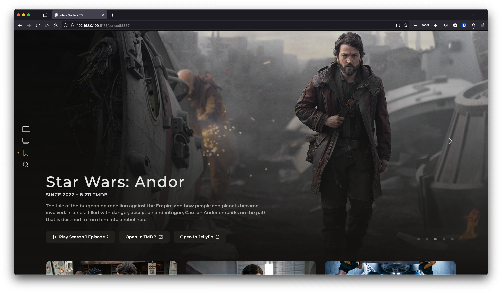

# Reiverr 1.0


Reiverr is a project that aims to create a single UI for interacting with TMDB, Jellyfin, Radarr and Sonarr, as well as be an alternative to Overseerr.

This project is still in alpha, and many features are still missing / being tested and changed. Contributions are welcome! See [contributing](#Contributing) for more information.


## Reiverr 2.0

This is the page for Reiverr 1.0, which is the original version of the project written in SvelteKit for web only. 
Reiverr 1.0 remains usable, but all development efforts are focused on Reiverr 2.0, and any fixes and features
are provided by the community as pull requests. This version uses the `reiverr-1.0` and `dev-1.0` branches.

When 2.0 was released, the `latest` docker tag was reserved for 2.0. If you want to keep using the 1.0 version,
and its future updates, you'll have to switch to the `latest-v1` tag or a specific version instead.

# List of major features

TMDB Discovery:

- Discover trending movies and TV shows
- Browse movies and TV shows by genre or network
- View details about movies and TV shows, such as cast, crew, ratings & a trailer.
- Movie & TV show search

Local Library & Playback

- Stream Movies & TV shows (from Jellyfin library)
- Create requests for movies & TV shows in Radarr & Sonarr
- Manage local library files
- View Radarr & Sonarr stats (disk space, items, etc.)

For a list of planned features & known bugs, see [Reiverr Taskboard](https://github.com/users/aleksilassila/projects/5).

# Installation

The easiest and the recommended way to install Reiverr is via Docker. Make sure to update the api keys and base URLs to match your setup.

Radarr & Sonarr API keys can be found under Settings > General in their respective web UIs. Jellyfin API key is located under Administration > Dashboard > Advanced > API Keys in the Jellyfin Web UI.

### Docker CLI

```sh
docker run -it --init \
  --name reiverr \
  --restart unless-stopped \
  -p 9494:9494 \
  -v /path/to/appdata/config:/config \
  ghcr.io/aleksilassila/reiverr:latest
```

### Docker compose

```yaml
version: '3.8'

name: reiverr

services:
  reiverr:
    image: ghcr.io/aleksilassila/reiverr:latest-v1
    container_name: reiverr
    ports:
      - 9494:9494
    volumes:
      - /path/to/appdata/config:/config
    restart: unless-stopped
```

### Manual Instructions

1. Requirements:
   - Node v18.14.0 or high
   - NPM v9.3.1 or high
1. Clone from **master** or download the [latest source](https://github.com/aleksilassila/reiverr/releases)
1. Build the app:
   ```sh
   npm ci --ignore-scripts
   npm run build
   npm ci --ignore-scripts --omit=dev # optional
   ```
1. Start the app:
   ```sh
   npm run deploy
   ```

### Reiverr will be accessible via port 9494 by default.

If you have any questions or run into issues or bugs, you can start a [discussion](https://github.com/aleksilassila/reiverr/discussions), open an [issue](https://github.com/aleksilassila/reiverr/issues) or check out the [Discord channel](https://discord.gg/enypPQh6pz).

## Other Platforms

The roadmap includes plans to support the following platforms in the future:

- Windows Desktop App
- MacOS Desktop App
- Android TV / TizenOS

# Contributing

## Before you contribute

Unlike the most Servarr projects, this one is built with Svelte and SvelteKit. If you haven't used Svelte before, don't worry, this was my first Svelte project too. I'd recommend reading the official [Svelte tutorial](https://learn.svelte.dev/tutorial/welcome-to-svelte) to get started.

To see a list of missing features & known bugs that you can help with, see [Reiverr Taskboard](https://github.com/users/aleksilassila/projects/5). Feel free to also create your own issues for bug reports or feature requests, as well as discussions for general questions.

- If you are taking on an existing bug or feature ticket, please comment on the issue or mark yourself as an assignee to avoid multiple people working on the same thing.
- If the ticket is vague or missing information, please ask for clarification in the comments.
- UI style must match the rest of the project and it is a good idea to discuss the design beforehand, especially for larger design choices (issues labelled with "design").
- [Conventional commits](https://www.conventionalcommits.org/en/v1.0.0/) are encouraged.
- When creating a pull request, please make sure to target the `dev` branch and mark the PR as a draft if it is a work in progress.

I'm not a designer, so if you have any ideas for improving the UI, I'd love to learn about them. If you are a designer and would like to help, contributions are much appreciated!

# Development

To get started with development:

1. Clone the repository
2. Checkout the `dev` branch
3. Run `npm install`
4. Run `npm run dev`

Alternatively, you can run `docker-compose up`.

For Webstorm users: I'd recommend using VS Code as it has way better Svelte Typescript support.

Useful resources:

- https://developer.themoviedb.org/reference
- https://api.jellyfin.org/
- https://sonarr.tv/docs/api/
- https://radarr.video/docs/api/
- https://github.com/jellyfin/jellyfin-web
- Network tab in the browser in Jellyfin, Radarr & Sonarr web UIs

# Additional Screenshots




