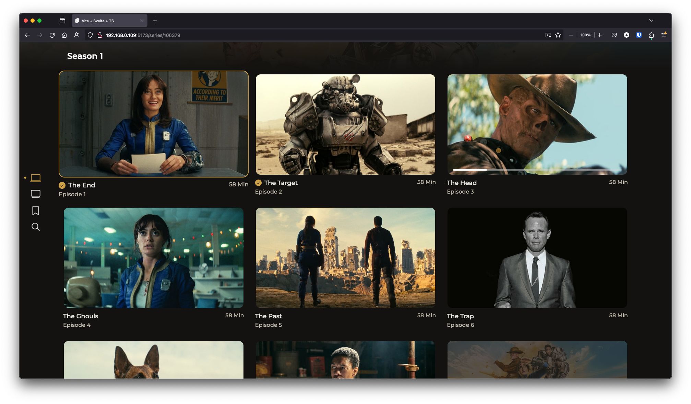

# Reiverr


Reiverr is a project that aims to create a single UI for interacting with TMDB, streaming content from various sources and be an alternative to Overseerr.

This project is still in early stages, and many features are still missing / being tested and changed. Contributions are welcome! See [contributing](#Contributing) for more information.


## Reiverr 1.0

This is the page for Reiverr 2.0, which is a rewrite of the project with TVs in mind. It still lacks many features of the previous version. If you want a more stable experience, or only care about the web app, you might want to check out the [1.0 branch](https://github.com/aleksilassila/reiverr/tree/reiverr-1.0) for now.

# List of major features

TMDB Discovery:

- Discover trending movies and TV shows
- Get personalized recommendations based on your TMDB ratings
- View details about movies and TV shows, such as cast, crew, ratings & a trailer.
- Movie & TV show search

Content Playback Plugins

- Offers a plugin API that allows users to access media from various external sources
- Currently built-in plugins for streaming content are:
  - [Jellyfin plugin](backend/packages/jellyfin.plugin/README.md)
  - [Torrent-Stream plugin](backend/packages/torrent-stream.plugin/README.md) (requires Jackett)

For a list of planned features & known bugs, see [Reiverr Taskboard](https://github.com/users/aleksilassila/projects/5).

# Installation

The easiest and the recommended way to install Reiverr is via Docker. Make sure to update the api keys and base URLs to match your setup.

### Docker CLI

```sh
docker run -it --init \
  --name reiverr \
  --restart unless-stopped \
  -p 9494:9494 \
  -v /path/to/appdata/config:/config \
  -v /path/to/appdata/plugins:/plugins \
  ghcr.io/aleksilassila/reiverr:latest
```

### Docker compose

```yaml
version: '3.8'

name: reiverr

services:
  reiverr:
    image: ghcr.io/aleksilassila/reiverr:latest
    container_name: reiverr
    ports:
      - 9494:9494
    environment:
      - SECRET=your_secret_here # optional, used to sign JWT tokens for authentication. If not set, sessions will not persist between server restarts. Use a random string.
      - ADMIN_USERNAME=admin # optional
      - ADMIN_PASSWORD=admin # optional
    volumes:
      - /path/to/appdata/config:/config
      - /path/to/appdata/plugins:/plugins
    restart: unless-stopped
```

### Building from Source

1. Requirements(ish):
   - Node v18.14.0 or higher
   - NPM v9.3.1 or higher
2. Clone from **master** or download the [latest source](https://github.com/aleksilassila/reiverr/releases)
3. Build & run the app:\
   `npm install`\
   `npm install --prefix backend`\
   `npm run preview`

#### Reiverr will be accessible via port 9494 by default.

### Tizen / Samsung Smart TVs

To be able to use Reiverr on TVs, you'll still need to host the backend server on a separate device. See the above methods for instructions on how to set up the backend / web app.

There are plans to attempt getting the app to the official store. In the meantime, you have to manually build and install the app using Tizen Studio or the CLI, following roughly these steps:

1. Follow the manual installation steps above to install the dependencies (npm install)
2. Download either Tizen Studio or the CLI tools from the [official website](https://developer.tizen.org/development/tizen-studio/download)
3. [Connect Tizen Studio to your TV](https://developer.samsung.com/smarttv/develop/getting-started/using-sdk/tv-device.html)
4. Use the following command to build and install the app on your TV:\
   \
   `npm run build:tizen;C:\tizen-studio\tools\ide\bin\tizen.bat build-web -- tizen;C:\tizen-studio\tools\ide\bin\tizen.bat package -t wgt -o .\tizen -- .\tizen\.buildResult\;C:\tizen-studio\tools\ide\bin\tizen.bat install -n .\tizen\Reiverr.wgt -t QE55Q64TAUXXC`.\
   \
   You may need to replace the paths for Tizen Studio tools according to your installation location, as well as the device identifier, which was in my case the tv model number.\
   \
   Alternatively, you can open the project in Tizen Studio and install the project on a device from there. For more instructions on run a project on a device, see [here](https://docs.tizen.org/application/web/get-started/tv/first-samsung-tv-app/#run-on-a-target-device).

If you have any questions or run into issues or bugs, you can start a [discussion](https://github.com/aleksilassila/reiverr/discussions), open an [issue](https://github.com/aleksilassila/reiverr/issues) or check out the [Discord channel](https://discord.gg/enypPQh6pz). If find a feature request that you'd like to see implemented, you can react to it with a thumbs up.

## Other Platforms

The roadmap includes plans to support the following platforms in the future:

- Android TV / WebOS
- Windows Desktop App
- MacOS Desktop App

# Post Installation

To create the first user account, you can log in with any credentials and an admin account will be created. Alternatively, you can define the admin username and password using environment variables, as seen in the Docker Compose example. A new admin account is only created if there are no previous accounts with the same name.

To get access to media playback, connect to plugins by adding media sources in the settings. Additional plugins can be installed by dropping them in the `/plugins` folder. To get most out of Reiverr, it is recommended to also connect to TMDB.

> Hint: Jellyfin API key is located under Administration > Dashboard > Advanced > API Keys in the Jellyfin Web UI.

# Contributing

Unlike the most Servarr projects, this one is built with Svelte and NestJS. If you haven't used Svelte before, don't worry, this was my first Svelte project too. I'd recommend reading the official [Svelte tutorial](https://learn.svelte.dev/tutorial/welcome-to-svelte) to get started.

To see a list of missing features & known bugs that you can help with, see [Reiverr Taskboard](https://github.com/users/aleksilassila/projects/7). Feel free to also create your own issues for bug reports or feature requests, as well as discussions for general questions. Issues with the `community` label are issues that I can't or won't work on myself, and are left for the community to pick up. Feel free to work on any issues though, even without the label.

Before you contribute:

- If you are taking on an existing bug or feature ticket, it is encouraged to comment on the issue or mark yourself as an assignee at some point to avoid multiple people working on the same thing.
- If the ticket is vague or missing information, please ask for clarification in the comments.
- UI style should match the rest of the project, and it is a good idea to discuss the design beforehand, especially for larger design choices (issues labelled with `design`).
- [Conventional commits](https://www.conventionalcommits.org/en/v1.0.0/) are encouraged.
- When creating a pull request, please make sure to target the `dev` branch and mark the PR as a draft if it is a work in progress.

I'm not a designer, so if you have any ideas for improving the UI, I'd love to learn about them. If you are a designer and would like to help, contributions are much appreciated! Also the project is still missing a logo :)

# Development

To get started with development:

1. Clone the repository
2. Check out the `dev` branch
3. Install dependencies\
   `npm install`\
   `npm install --prefix backend`
4. To start the frontend: `npm run dev` or `npx vite --host` if you want to expose the server
5. To start the backend: `npm run --prefix backend start:dev`

## Notes

- 2.0 will primarily target TVs, so the UI must be optimized with TVs in mind. This means larger text, buttons, etc. [Design Guide for Android TV](https://developer.android.com/design/ui/tv/guides/styles/layouts) is a good resource for how to design for TVs.
- The app should support old browsers all the way to Chromium 69, as that's what used in Tizen 5.5. This means that you might not be able to use the latest browser features, or that you'll have to use a polyfill. [caniuse.com](https://caniuse.com/) is a great resource if you need to check compatibility.
  - Most of the time you don't need to worry about this, but one big feature that's not available in older browsers is css `gap` property. You can use the `space-x` and `space-y` classes from Tailwind CSS to achieve the same effect.

## Plugins

If you'd like to develop your own plugin, easiest way to get started is by getting your hands dirty and checking how things are done in the built-in plugins. Couple of things to note:

- Plugins are npm packages, that contain a `package.json` in a folder with `.plugin` extension.
- Plugins have to implement (and default export) the `PluginProvider` class that can be imported from the [](backend/packages/reiverr-plugin) package.
  - To install the [reiverr-plugin package](https://github.com/aleksilassila/reiverr/pkgs/npm/reiverr-plugin) from Github's npm registry, follow the steps outlined here: [Working with the Github npm registry](https://docs.github.com/en/packages/working-with-a-github-packages-registry/working-with-the-npm-registry#installing-a-package) (you'll need a .npmrc file and an access token to a Github account)
  - The built-in packages use npm workspaces, which doesn't work if you're developing outisde of the repository
- For a better understanding of the anatomy of a plugin, see the documentation in the following file: [reiverr-plugin/src/plugin.ts](backend/packages/reiverr-plugin/src/plugin.ts)

## Useful resources

- https://developer.themoviedb.org/reference
- https://api.jellyfin.org/
- https://github.com/jellyfin/jellyfin-web
- Network tab in the browser in Jellyfin, Radarr & Sonarr web UIs

# Additional Screenshots



