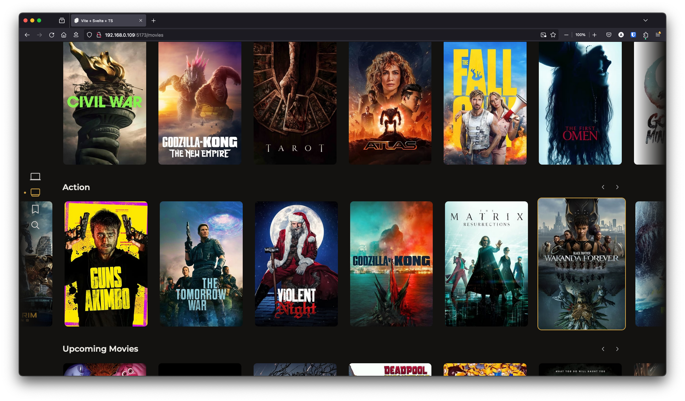

# Reiverr

Reiverr is a project that aims to create a single UI for interacting with TMDB, Jellyfin, Radarr and Sonarr, as well as be an alternative to Overseerr.

This project is still in alpha, and many features are still missing. Contributions are welcome and necessary for the project to achieve it's full potential! If you would like to contribute, see [contributing](#Contributing).




# List of major featuers

TMDB Discovery:

- Discover trending movies and TV shows
- Browse movies and TV shows by genre or network
- View details about movies and TV shows, such as cast, crew, ratings & a trailer.
- Movie & TV show search

Local Library & Playback

- Steam Movies & TV shows (from Jellyfin library)
- Create requests for movies & TV shows in Radarr & Sonarr
- Manage local library files
- View Radarr & Sonarr stats (disk space, items, etc.)

For a list of planned features & known bugs, see [Reiverr Taskboard](https://github.com/users/aleksilassila/projects/5).

# Getting started

# Contributing

Unlike the most Servarr projects, this one is built with Svelte and SvelteKit. If you haven't used Svelte before, don't worry, this was my first Svelte project too. I'd recommend reading the official [Svelte tutorial](https://learn.svelte.dev/tutorial/welcome-to-svelte) to get started.

To see a list of missing features & known bugs that you can help with, see [Reiverr Taskboard](https://github.com/users/aleksilassila/projects/5). Feel free to also create your own issues for bug reports or feature requests, as well as discussions for general questions.

Before you contribute:

- If you are taking on an existing bug or feature ticket, please comment on the issue or mark yourself as an assignee to avoid multiple people working on the same thing.
- If the ticket is vague or missing information, please ask for clarification in the comments.
- UI style must match the rest of the project and it is a good idea to discuss the design beforehand, especially for larger design choices (issues labelled with "design")

I'm not a designer, so if you have any ideas for improving the UI, I'd love to implement them. If you are a designer and would like to help, contributions are much appreciated!

# Development

To get started with development:

1. Clone the repo
2. Add and populate `.env` file
3. Run `npm install`
4. Run `npm run dev`

Example .env file:

```env
# The PUBLIC_ prefix is required for SvelteKit to expose the variable to the client.
# If you are exposing the server to the internet (not recommended), you should use HTTPS.

# Fill in the blanks and change the base URLs to match your setup.

PUBLIC_RADARR_API_KEY=
PUBLIC_RADARR_BASE_URL=http://192.168.0.129:7878

PUBLIC_SONARR_API_KEY=
PUBLIC_SONARR_BASE_URL=http://192.168.0.129:8989

PUBLIC_JELLYFIN_API_KEY=
PUBLIC_JELLYFIN_URL=http://192.168.0.129:8096
```
